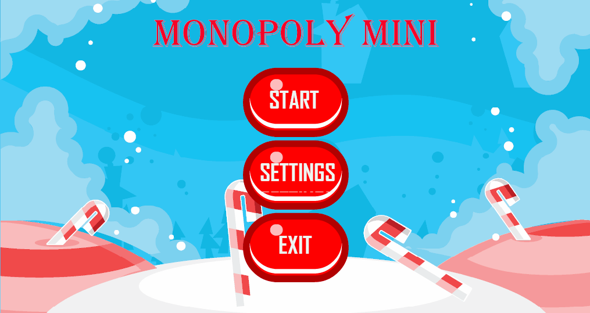

<h1>MONOPOLY</h1>

<h2> Game dynamics  </h2>

Monopoli (v izvirniku angleško Monopoly) je ameriška igra na deski za dva do šest igralcev (v nekaterih različicah do osem), v kateri igralci prevzamejo vlogo posestnikov in med premikanjem po označenih poljih kupujejo ali prodajajo ta polja ter investirajo vanje z gradnjo hiš in hotelov. Ostali igralci morajo lastniku polja, na katerem se znajdejo, plačati najemnino. Cilj igre je s premišljenim investiranjem prevzeti večino polj in prisiliti ostale igralce v bankrot. Po rezultatu – monopolu nad nepremičninskim trgom – ima igra tudi ime.

<h3> Pravila igre:</h3>
Igralac vrze kocku ter se premika tolko polj na deski,
 ce se ustavi na polju z mestom lahko ga kupi,
 ce se ustavi na "chance" polju dobi nekateru sansu v igri(npr da gre naprej 2 polja...),
 ce se ustavi na "surprise" polju dobi nekatero presenecenje(npr denarj)
 ce se ustavi na "go to jail" polju gre v zapor, iz zapore lahko pride ven tak da plati: 50, ce ima "Go Out of Jail free" kartu lahko
jo izkoristi
 Zmagovalec je tisti ki zadnji bankrotira

<h2> Game mechanics </h2>

 Player movment, buying fields 

<h2> Game elements: </h2>
* Players
* Fields with cities,
* Surprise fields,
* Chance fields.
* Go to jail field

<h2> App demo <h2> 
  

